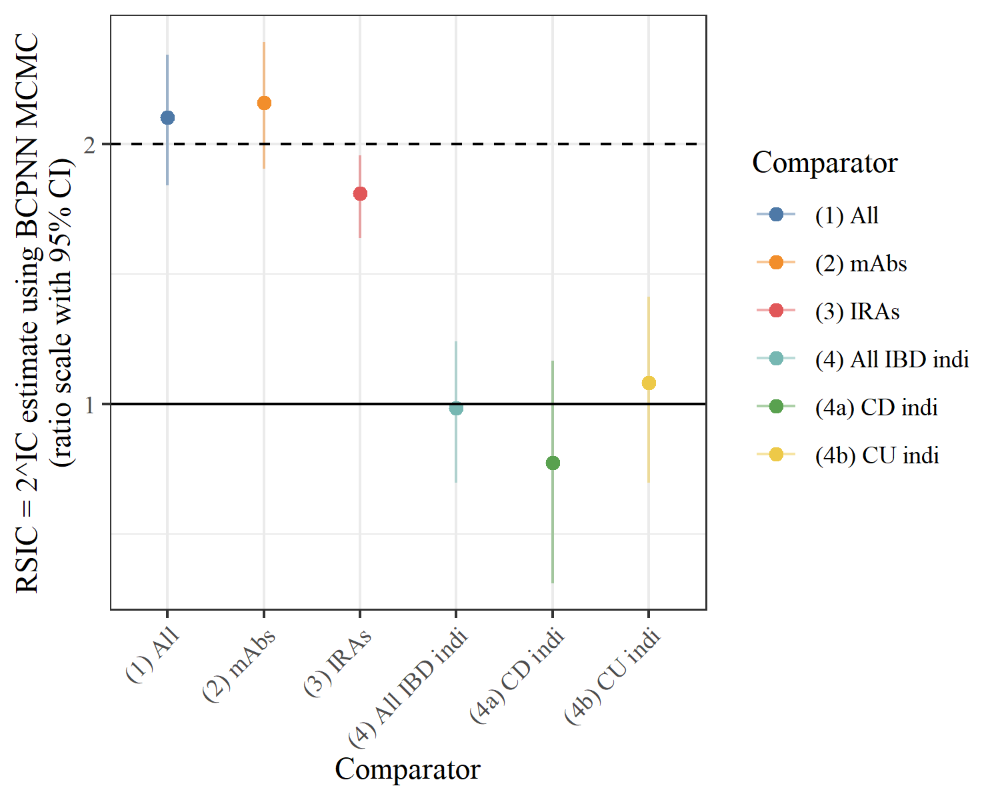

# `vedol_panc`


Signal detection for the adverse reaction of pancreatitis in vedolizumab use 


## How to run code

The following steps will allow you to run `analyse_vedol_panc.R` to reproduce Table 2 and Figure 1 of
[Duszynski *et al.* (2022)](https://doi-link-to-come-com):

* Make sure you have [R](https://cran.r-project.org/) and [RStudio](https://www.rstudio.com/products/rstudio/download/) installed.
* Download the `vedol_panc.zip` file (on the [repo page](https://github.com/tystan/vedol_panc): green `Code` button `->` `Download ZIP` button).
* Unzip the download.
* Double click the `vedol_panc.Rproj` file - this should open an RStudio session.
* (only has to be performed once) Make sure the prerequisite packages are installed by running the below command in the R console:
```r
install.packages(
  c(
    "arrow", "dplyr", "tibble", 
    "ggplot2", "knitr", "tidyr"
  )
)
# install pharmsignal package from github
# NOTE: devtools package needs to be installed - please see 
#    https://www.r-project.org/nosvn/pandoc/devtools.html
devtools::install_github('tystan/pharmsignal')
```
* Now the code is ready to be run:
    + Open the `analyse_vedol_panc.R` file by clicking on `Files` tab in the `Files/Plots/Packages/...` pane of RStudio.
    + Now to finally run the code in `analyse_vedol_panc.R` in the R console.


## Code outputs: Table 2 and Figure 1

*Table 2: Signal detection estimates and 95% confidence intervals (RSIC = 2^IC using BCPNN MCMC) of vedolizumab v other comparators for pancreatitis*

```r
|Comparator       | N vedol and panc| N vedol| N comparator and panc| N comparator|RSIC = 2^IC        |
|:----------------|----------------:|-------:|---------------------:|------------:|:------------------|
|(1) All          |              124|   19034|                 21272|      7067209|2.15 (1.79, 2.54)* |
|(2) mAbs         |              124|   19034|                  1550|       558201|2.24 (1.87, 2.63)* |
|(3) IRAs         |              124|   19034|                    78|        35486|1.75 (1.56, 1.94)  |
|(4) All IBD indi |               96|   14797|                   824|       125466|0.99 (0.81, 1.18)  |
|(4a) CD indi     |               40|    7885|                   537|        89236|0.86 (0.62, 1.12)  |
|(4b) CU indi     |               52|    6538|                   265|        35658|1.06 (0.81, 1.33)  |
```



*Figure 1: Signal detection estimates and 95% confidence intervals (RSIC = 2^IC using BCPNN MCMC) of vedolizumab v other comparators for pancreatitis*.

